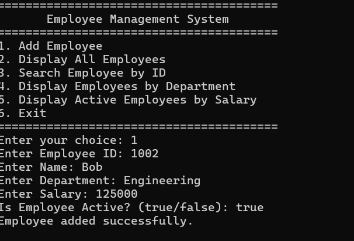
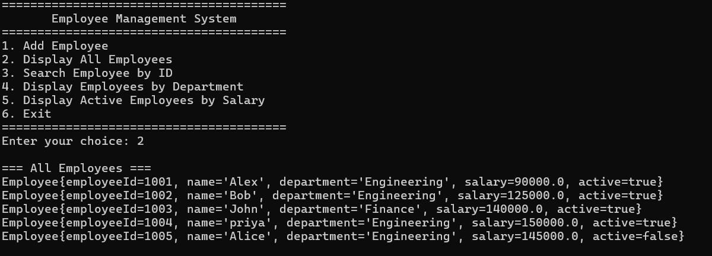
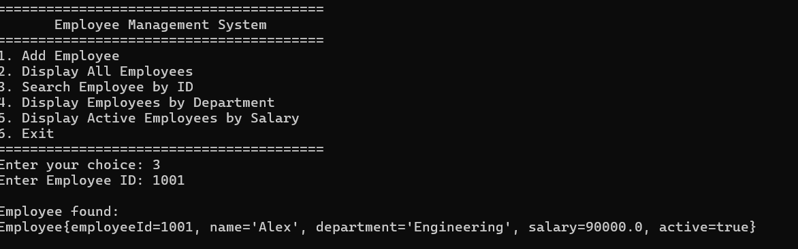
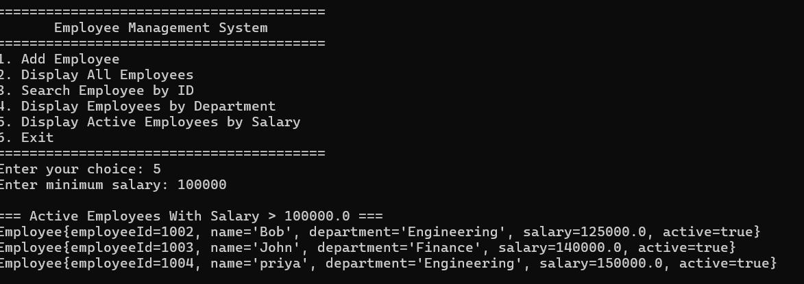

# Employee Management Console Application

## Overview

A Java-based console application for managing employee information.

## Requirements

* Java 21+
* IntelliJ IDEA or any Java IDE

## Features

* Add employees
* Display all employees
* Search employee by Employee ID
* Display employees by department
* Display active employees with salary greater than a given value
* Handle employee-not-found scenarios
* Validate user input
* Prevent duplicate Employee IDs

## Java Concepts Demonstrated

* Variables, data types, methods
* Conditional statements and loops
* Classes and objects
* Encapsulation
* Interface and abstraction
* Collections (`HashMap`)
* Exception handling
* Custom exceptions
* Lambda expressions
* Stream API

## Project Structure

```text
src/
└── com/example/employee/
    ├── Employee.java
    ├── EmployeeNotFoundException.java
    ├── DuplicateEmployeeException.java
    ├── EmployeeRepository.java
    ├── InMemoryEmployeeRepository.java
    ├── EmployeeService.java
    └── Main.java
```

## How to Run

1. Open the project in IntelliJ IDEA.
2. Configure Java 21 as the Project SDK.
3. Open `Main.java`.
4. Run `Main.main()`.
5. Follow the console menu.

## Sample Data

```text
101 | Alex  | Engineering | 90000  | Active
102 | Sam   | Engineering | 125000 | Active
103 | John  | Finance     | 140000 | Inactive
104 | Priya | Engineering | 150000 | Active
```

For active employees with salary greater than `100000`, the expected result is:

```text
Sam
Priya
```

## Screenshots

### 1. Add Employees



### 2. Display All Employees



### 3. Search Employee



### 4. Filtering


